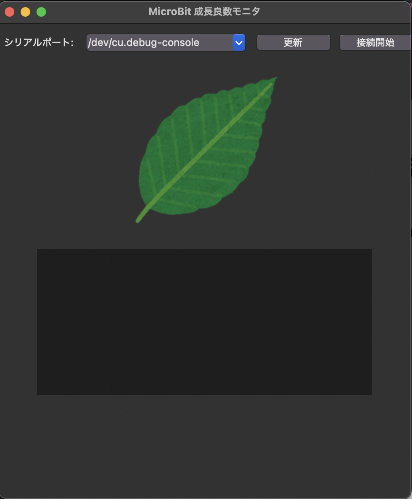

# 🌱 Micro:bit Growth Monitor
<br>
This Python desktop application was developed as part of a **Sensing Engineering course group project** to visualize plant growth conditions in real time.  
It receives **temperature** and **light** data from a **Micro:bit**, calculates a **Growth Index**, and displays a dynamically color-changing leaf.  
In this project, I was responsible for **both the hardware setup on the Micro:bit and the software program** that receives data, calculates the index, and updates the leaf display 🍃🌿

---

## 🧩 Overview
- Reads `temperature` and `light` values from a Micro:bit via serial communication  
- Calculates a **Growth Index (0–100)** representing plant growth conditions  
- Displays live readings and a dynamically changing **leaf image** using Tkinter + Pillow  
- Developed as part of a **Sensing Engineering course group work**

---

## 🎨 Leaf Color Logic
<br>
The leaf’s **brightness** and **saturation** are adjusted according to the Growth Index.

| Growth Index | Appearance | Meaning |
|---------------|-------------|----------|
| 80–100 | 🌿 Bright vivid green | Ideal environment |
| 40–79 | 🍃 Medium green | Moderate condition |
| 0–39 | 🌲 Dark green | Poor condition |

The leaf does **not** turn red or brown.  
Instead, the green hue remains constant while its **vividness and brightness** change, producing a natural, realistic visual effect.  
This is implemented using Pillow’s `ImageEnhance.Color` and `ImageEnhance.Brightness`.

---

## 🌿 Growth Index Calculation

| Parameter | Description |
|------------|-------------|
| Temperature | Ideal: 25 °C (scored between 15–35 °C) |
| Light | Ideal: 200 or higher (normalized to 1.0) |
| Growth Index | Average of temperature and light scores × 100 |

**Formula:**
```python
temp_score = max(0, 1 - abs(temp - 25) / 10)
light_score = min(light / 200, 1.0)
growth_index = (temp_score * 0.5 + light_score * 0.5) * 100
